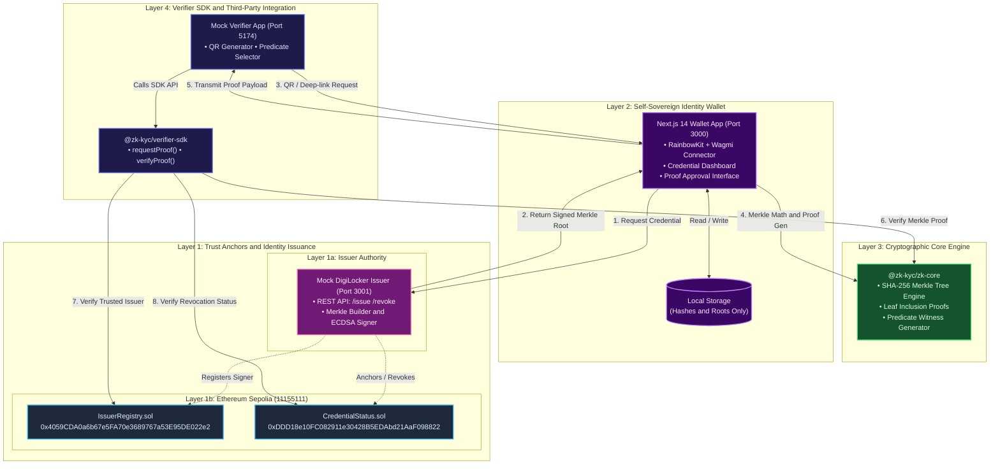
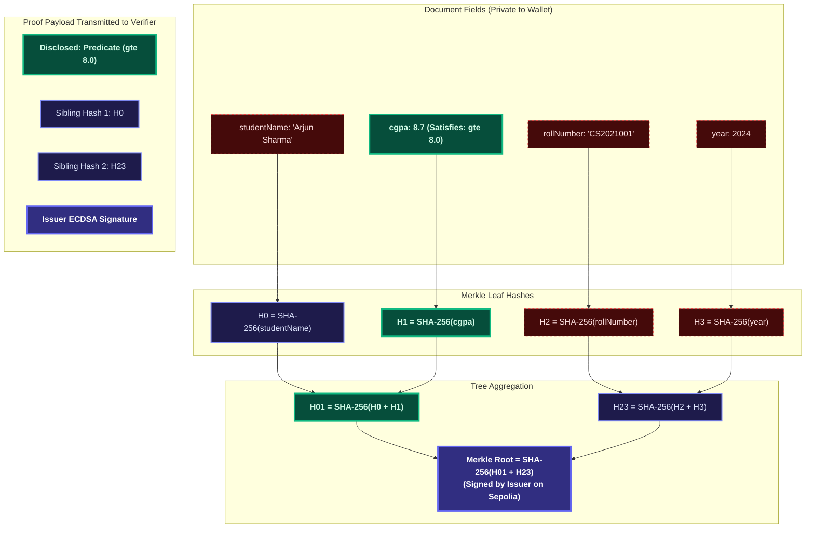
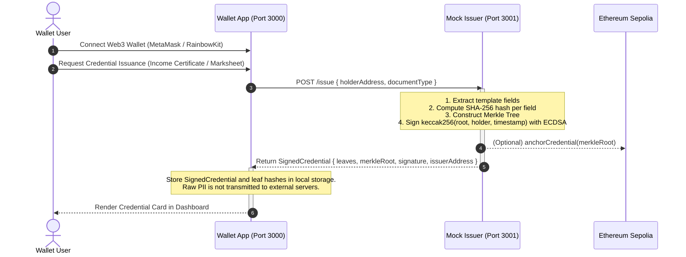
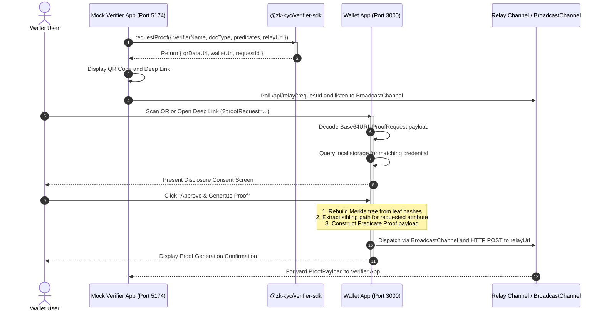
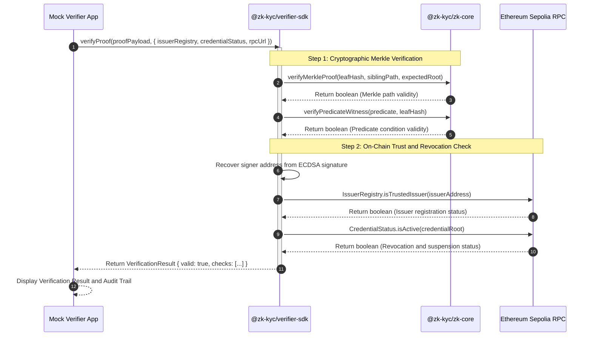
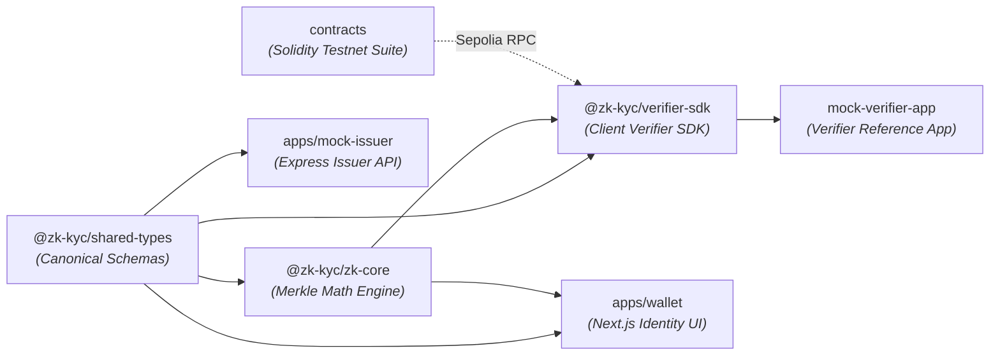

# ZK-KYC — Zero-Knowledge Identity Wallet & Verifier SDK

<div align="center">

**A privacy-preserving digital credential wallet with selective-disclosure proofs**  
*Prove what you know without revealing what you hold.*

[-6366f1?style=for-the-badge&logo=ethereum&logoColor=white)](https://sepolia.etherscan.io)
[](https://soliditylang.org)
[-000000?style=for-the-badge&logo=next.js&logoColor=white)](https://nextjs.org)
[](https://www.typescriptlang.org)
[](https://pnpm.io)
[](https://github.com)

</div>

---

## Executive Overview

ZK-KYC is a **user-controlled digital credential wallet** and **client-side verification SDK** featuring a **zero-knowledge selective-disclosure layer**. It is engineered as a privacy-first extension to national identity infrastructures such as **DigiLocker** and **NAD** (National Academic Depository).

### The Privacy Problem
Traditional KYC requires users to upload full documents or scans of government-issued IDs. This exposes sensitive Personally Identifiable Information (PII) — including full names, national identity numbers, home addresses, dates of birth, and exact financial figures — to third parties that only need to verify a single compliance condition.

### The ZK-KYC Solution
With ZK-KYC:
1. **Self-Sovereign Storage**: Only cryptographic leaf hashes and the signed Merkle root are stored on the user device. Raw documents are never uploaded to a central server.
2. **Selective Disclosure and Predicate Proofs**: Users can cryptographically prove specific conditions (for example, `annualIncome >= 800000` or `cgpa >= 8.0`) without disclosing exact figures or unrelated credential attributes.
3. **Standalone Verifier SDK**: Third-party applications integrate verification client-side with minimal code, backed by on-chain trust registries on **Ethereum Sepolia**.

> **Architecture Principle**: Strict separation of concerns — **Wallet != Verifier**. The wallet manages identity and approves disclosures; verifier applications only consume cryptographic proofs via the installable SDK.

---

## System Architecture



---

## Merkle Tree and Selective Disclosure Mechanics

The diagram below illustrates how a four-field credential proves a single condition without revealing any other attributes:



> **Privacy Guarantee**: The verifier receives only `H0` and `H23` alongside `H1`. The verifier calculates `SHA-256(H0 + H1) = H01` and `SHA-256(H01 + H23) = Root`. The computed root matches the issuer signature verified against `IssuerRegistry.sol`. The verifier learns nothing about `studentName`, `rollNumber`, or `year`.

---

## End-to-End Sequence Flows

### 1. Credential Issuance Flow



---

### 2. Zero-Knowledge Proof Request and Generation Flow



---

### 3. Proof Verification and Trust Anchoring Flow



---

## Monorepo Architecture and Package Matrix

The project is organized as a **pnpm workspace** with modular boundaries between identity management, cryptographic logic, verification interfaces, and on-chain contracts:



### Workspace Packages Breakdown

<details open>
<summary><b>apps/wallet — Self-Sovereign Identity Web Application</b></summary>

* **Port**: `3000` | **Framework**: Next.js 14 (App Router) + Wagmi + RainbowKit
* **Function**: User-facing credential wallet. Imports signed credentials, stores leaf hashes in `localStorage`, visualizes Merkle tree nodes, and handles selective disclosure approval requests.
* **Key Files**:
  * [`src/lib/proof-generation.ts`](file:///e:/Projects/ZK-Kyc/apps/wallet/src/lib/proof-generation.ts) — Browser-safe ZK proof witness generation and Base64URL encoding/decoding.
  * [`src/lib/credential-store.ts`](file:///e:/Projects/ZK-Kyc/apps/wallet/src/lib/credential-store.ts) — Client-side storage abstraction ensuring raw values remain on-device.
  * [`src/app/proof-request/page.tsx`](file:///e:/Projects/ZK-Kyc/apps/wallet/src/app/proof-request/page.tsx) — Proof request consent screen with dual `BroadcastChannel` and HTTP dispatch.
</details>

<details open>
<summary><b>apps/mock-issuer — Simulated Government Issuer Service</b></summary>

* **Port**: `3001` | **Framework**: Express + TypeScript + Ethers.js v6
* **Function**: Simulates a certified DigiLocker / University issuer. Extracts document fields, builds SHA-256 Merkle trees, and signs Merkle roots with ECDSA keys.
* **Endpoints**:
  * `POST /issue` — Issues signed credentials with Merkle root and leaf hashes.
  * `POST /revoke` — Revokes an existing credential root on-chain.
  * `GET /documents` — Lists credential templates (`INCOME_CERTIFICATE`, `MARKSHEET`).
  * `GET /issuer-info` — Returns the issuer public Ethereum address.
</details>

<details open>
<summary><b>packages/zk-core — Cryptographic Merkle and Predicate Engine</b></summary>

* **Type**: Framework-agnostic TypeScript Library | **Test Suite**: 53 Unit Tests (Jest)
* **Function**: Core math engine responsible for SHA-256 Merkle tree construction, branch extraction, sibling path verification, and predicate witnesses.
* **Key Exports**:
  * `MerkleTree.fromFields(fields)` — Constructs deterministic balanced Merkle trees from document key-value pairs.
  * `generateFieldProof(tree, index)` — Computes sibling hashes for leaf inclusion proofs.
  * `verifyMerkleProof(leaf, proof, root)` — Verifies inclusion proofs in logarithmic time.
  * `generatePredicateProof(field, predicate)` — Generates predicate witnesses (`gte`, `lte`, `eq`, `range`).
</details>

<details open>
<summary><b>packages/verifier-sdk — Third-Party Verifier SDK and Reference Implementation</b></summary>

* **Type**: Zero-dependency Browser/Node SDK | **Reference App**: Port `5174` (Vite + React)
* **Function**: Installable npm package enabling third-party developers to request and verify ZK KYC proofs.
* **Key Exports**:
  * `requestProof(options)` — Generates standardized QR codes and Base64URL deep-links.
  * `verifyProof(payload, options)` — Executes cryptographic and on-chain verification pipeline.
  * `readIssuerRegistry(address, rpc)` and `readCredentialStatus(root, rpc)` — Sepolia RPC contract readers.
</details>

<details open>
<summary><b>contracts — Smart Contracts Suite</b></summary>

* **Network**: Ethereum Sepolia (`11155111`) | **Tooling**: Hardhat + Solidity 0.8.24 + TypeChain
* **Contracts**:
  * [`IssuerRegistry.sol`](file:///e:/Projects/ZK-Kyc/contracts/contracts/IssuerRegistry.sol) — Whitelist registry for certified KYC issuers.
  * [`CredentialStatus.sol`](file:///e:/Projects/ZK-Kyc/contracts/contracts/CredentialStatus.sol) — Status registry mapping `bytes32 credentialRoot => Status (Active / Revoked / Suspended)`.
</details>

---

## Live Smart Contracts on Ethereum Sepolia

The trust anchors are deployed and verified on **Ethereum Sepolia (Chain ID: 11155111)**:

<div align="center">

| Smart Contract | Deployed Address | Block Explorer | Status |
|---|---|---|---|
| **`IssuerRegistry`** | `0x4059CDA0a6b67e5FA70e3689767a53E95DE022e2` | [View on Etherscan ↗](https://sepolia.etherscan.io/address/0x4059CDA0a6b67e5FA70e3689767a53E95DE022e2) | Active / Issuer Whitelisted |
| **`CredentialStatus`** | `0xDDD18e10FC082911e30428B5EDAbd21AaF098822` | [View on Etherscan ↗](https://sepolia.etherscan.io/address/0xDDD18e10FC082911e30428B5EDAbd21AaF098822) | Active / Revocation Enabled |

</div>

```solidity
// Core Smart Contract Interfaces (Solidity 0.8.24)
interface IIssuerRegistry {
    function registerIssuer(address issuer) external;
    function revokeIssuer(address issuer) external;
    function isTrustedIssuer(address issuer) external view returns (bool);
}

interface ICredentialStatus {
    enum Status { Active, Revoked, Suspended }
    function anchorCredential(bytes32 credentialRoot) external;
    function updateStatus(bytes32 credentialRoot, Status newStatus) external;
    function getStatus(bytes32 credentialRoot) external view returns (Status);
    function isActive(bytes32 credentialRoot) external view returns (bool);
}
```

* **Public RPC Endpoint**: `https://ethereum-sepolia-rpc.publicnode.com`
* **Testnet Faucet**: [Google Cloud Web3 Sepolia Faucet](https://cloud.google.com/application/web3/faucet/ethereum/sepolia)

---

## Quick Start and Local Setup

### Prerequisites
* **Node.js** v18.0.0 or higher
* **pnpm** v8.0.0 or higher (`npm install -g pnpm`)
* **MetaMask** or an EVM wallet configured to **Ethereum Sepolia**

---

### 1. Clone and Install Dependencies
```bash
git clone https://github.com/aditya-raj9125/ZK-Kyc.git
cd ZK-Kyc
pnpm install
```

### 2. Environment Configuration
Copy the environment template:
```bash
cp .env.example .env
```
*(Pre-deployed Sepolia contract addresses and public RPC endpoints are configured by default.)*

### 3. Launch Services
Open **three terminal tabs**:

```bash
# Tab 1: Wallet Web Application (Port 3000)
pnpm dev:wallet

# Tab 2: Mock DigiLocker Issuer API (Port 3001)
pnpm dev:issuer

# Tab 3: Mock Verifier Reference Application (Port 5174)
pnpm dev:verifier
```

---

## End-to-End Verification Walkthrough

| Step | Application | Action | Cryptographic Operation |
|:---:|---|---|---|
| **1** | **Wallet** (`:3000`) | Connect MetaMask on **Sepolia** | Wallet initializes session via Wagmi and RainbowKit. |
| **2** | **Wallet** (`:3000`) | Click **"Issue Credential"** → *Income Certificate* | Mock Issuer (`:3001`) hashes attributes into a Merkle tree, signs the root with ECDSA, and returns the signed credential. Hashes are stored locally. |
| **3** | **Verifier** (`:5174`) | Configure predicate `annualIncome >= 800000` → Click **"Generate QR Code"** | SDK serializes the `ProofRequest` into a Base64URL string and produces a QR code and deep link. |
| **4** | **Wallet** (`:3000`) | Open deep link or scan QR → Click **"Approve & Generate Proof"** | Wallet resolves the request, derives the sibling path for `annualIncome`, builds the predicate proof, and transmits it via `BroadcastChannel` and HTTP relay. |
| **5** | **Verifier** (`:5174`) | Automatic result screen | Verifier receives the payload, verifies Merkle inclusion, executes on-chain registry reads (`IssuerRegistry` + `CredentialStatus`), and displays **Proof Valid**. |

---

## Cryptographic and Contract Test Suite

The repository contains test coverage for cryptographic algorithms, Merkle proofs, and smart contracts:

```bash
# 1. Cryptographic Core Unit Tests (53 Tests)
pnpm --filter @zk-kyc/zk-core test
```
```text
 PASS  tests/predicates.test.ts
  ✓ evaluatePredicate — equality, threshold (gte, lte, gt, lt), range (12 ms)
  ✓ generateEqProof & verifyFieldProof (15 ms)
  ✓ generatePredicateProof — commitment witnesses (18 ms)
 PASS  tests/merkle.test.ts
  ✓ hashField & hashPair — deterministic SHA-256 (6 ms)
  ✓ MerkleTree construction — 2, 4, 8, odd-leaf trees (24 ms)
  ✓ verifyMerkleProof — valid inclusion & invalid sibling rejection (19 ms)

Test Suites: 2 passed, 2 total
Tests:       53 passed, 53 total (100% Pass)
```

```bash
# 2. Hardhat Smart Contract Tests (34 Tests)
pnpm contracts:test
```
```text
  CredentialStatus
    ✔ stores the IssuerRegistry reference
    ✔ unanchored credentials default to Active (0)
    ✔ isActive returns true for unanchored credentials
    ✔ allows a trusted issuer to anchor a credential
    ✔ emits CredentialAnchored event
    ✔ reverts when called by non-trusted issuer
    ✔ allows the issuing issuer to revoke a credential
    ✔ emits StatusUpdated event with correct old/new status
    ✔ reverts when a different issuer tries to update status

  IssuerRegistry
    ✔ sets the deployer as owner
    ✔ starts with no trusted issuers
    ✔ allows owner to register an issuer
    ✔ emits IssuerRegistered event
    ✔ reverts when non-owner tries to register
    ✔ can register multiple issuers
    ✔ allows owner to revoke an issuer

  34 passing (14s)
```

---

## Verifier SDK Integration Guide

The `@zk-kyc/verifier-sdk` package enables verification integration for web and Node.js environments:

```bash
pnpm add @zk-kyc/verifier-sdk
```

### 1. Initiate Proof Request
```typescript
import { requestProof } from '@zk-kyc/verifier-sdk';

const { qrDataUrl, walletUrl, requestId } = await requestProof({
  verifierName: 'Enterprise Lending Application',
  verifierAddress: '0x1234...abcd',
  issuerAddress: '0x70997970C51812dc3A010C7d01b50e0d17dc79C8',
  documentType: 'INCOME_CERTIFICATE',
  predicates: [
    { field: 'annualIncome', operator: 'gte', value: 800000 }
  ],
  relayUrl: 'https://your-app.com/api/relay',
});
```

### 2. Verify Incoming Proof
```typescript
import { verifyProof, type ProofPayload } from '@zk-kyc/verifier-sdk';

async function handleProofVerification(proof: ProofPayload) {
  const result = await verifyProof(proof, {
    issuerRegistryAddress: '0x4059CDA0a6b67e5FA70e3689767a53E95DE022e2',
    credentialStatusAddress: '0xDDD18e10FC082911e30428B5EDAbd21AaF098822',
    rpcUrl: 'https://ethereum-sepolia-rpc.publicnode.com',
  });

  if (result.valid) {
    console.log('KYC Verification Successful');
    console.log('Verified Attributes:', result.disclosedFields);
    console.log('Issuer Address:', result.issuerAddress);
    console.log('Audit Checks:', result.checks);
  } else {
    console.error('Verification Failed:', result.error);
  }
}
```

---

## Security and Privacy Threat Model

| Threat / Attack Vector | Mitigation Strategy in ZK-KYC | Security Property |
|---|---|---|
| **Eavesdropping on Relay** | The proof payload contains only leaf hashes, sibling paths, and mathematical commitments. | **No PII Disclosure**: Observers cannot reconstruct raw names, income values, or identifier numbers. |
| **Credential Forgery** | The Merkle root is signed with the issuer private key via ECDSA (`secp256k1`). | **Unforgeability**: Altering an attribute requires breaking SHA-256 preimage resistance or ECDSA signatures. |
| **Revoked Credential Replay** | Verification performs live on-chain queries via `CredentialStatus.isActive(root)`. | **Immediate Invalidation**: Revoked credentials are systematically rejected on-chain. |
| **Issuer Impersonation** | Verification asserts issuer status via `IssuerRegistry.isTrustedIssuer(signer)`. | **On-Chain Governance**: Signatures from unauthorized addresses are discarded. |
| **Client Data Exfiltration** | Attribute values remain in browser storage and are never transmitted over the network. | **Self-Sovereign Privacy**: Neither the verifier nor intermediate relays receive the underlying document. |

---

## Documentation Directory

<div align="center">

| Document | Audience | Scope |
|---|---|---|
| **[System Architecture](docs/architecture.md)** | Core Engineers and Auditors | In-depth cryptographic specifications, Merkle structures, and circuit upgrade paths |
| **[SDK Integration Guide](docs/sdk-integration-guide.md)** | Third-Party Developers | API specifications and integration patterns for `@zk-kyc/verifier-sdk` |
| **[Assumptions and Reality Matrix](docs/assumptions.md)** | Reviewers and Evaluators | Technical audit of simulated interfaces versus production deployment requirements |
| **[Smart Contract Documentation](contracts/README.md)** | Solidity Developers | Contract ABIs, deployment instructions, and test runner configurations |

</div>

---

<div align="center">

**ZK-KYC Monorepo** · Ethereum Sepolia · Privacy-Preserving Self-Sovereign Identity

</div>
