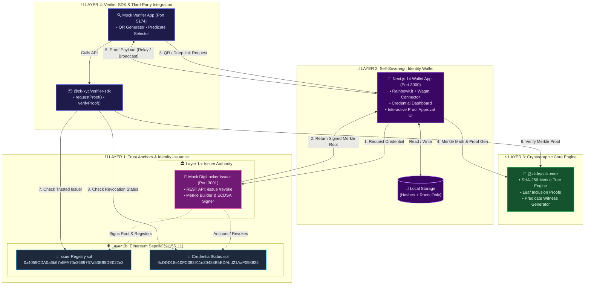
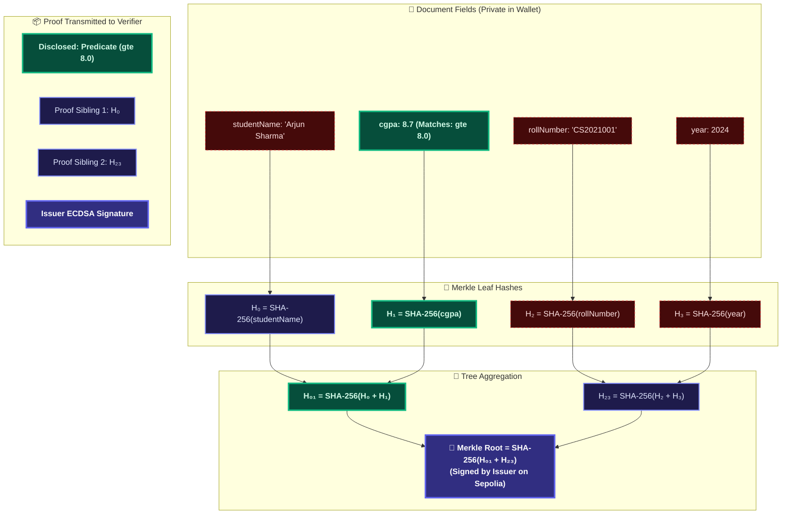
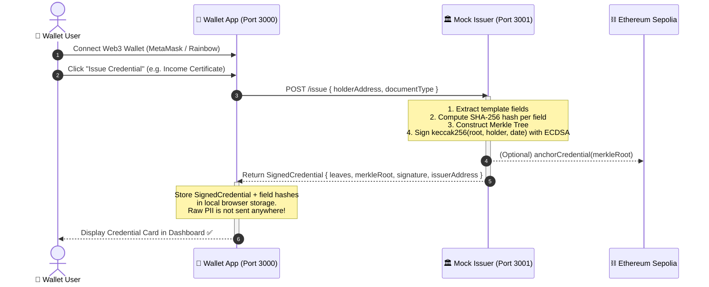
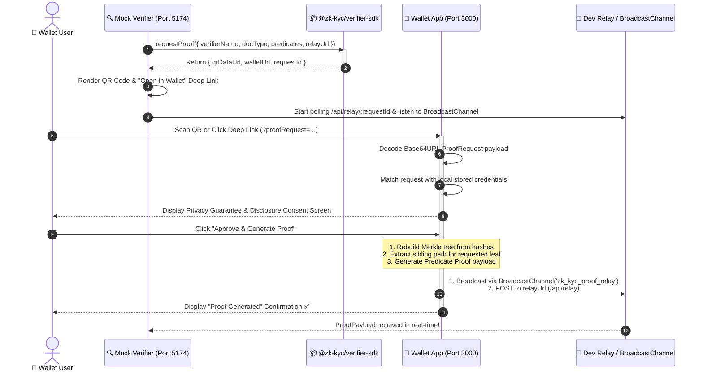

# ZK-KYC — Zero-Knowledge Identity Wallet & Verifier SDK

<div align="center">

**A privacy-preserving digital credential wallet with selective-disclosure proofs**  
*Prove what you know without revealing what you hold.*

[-6366f1?style=for-the-badge&logo=ethereum&logoColor=white)](https://sepolia.etherscan.io)
[](https://soliditylang.org)
[-000000?style=for-the-badge&logo=next.js&logoColor=white)](https://nextjs.org)
[](https://www.typescriptlang.org)
[](https://pnpm.io)
[](https://github.com)

</div>

---

## 🌟 Executive Overview

ZK-KYC is a **user-controlled digital credential wallet** and **client-side verification SDK** featuring a **zero-knowledge selective-disclosure layer**. It is engineered as a privacy-first extension to national identity infrastructures like **DigiLocker** and **NAD** (National Academic Depository).

### The Privacy Problem
Traditional KYC requires users to upload full PDFs or scans of government IDs. This leaks sensitive personal identifiable information (PII) such as full names, Aadhaar/ID numbers, home addresses, dates of birth, and exact financial figures to third parties that only need to confirm a single eligibility rule.

### The ZK-KYC Solution
With ZK-KYC:
1. **Self-Sovereign Storage**: Only cryptographic leaf hashes and the signed Merkle root are stored on the user's device. No raw documents are ever uploaded to a central server.
2. **Selective Disclosure & Predicate Proofs**: Users can cryptographically prove specific conditions (*"annualIncome ≥ 8 LPA"* or *"CGPA ≥ 8.0"*) without revealing exact numbers or any other credential fields.
3. **Standalone Verifier SDK**: Any third-party application can integrate verification with 3 lines of code. Verification runs client-side with zero backend dependencies, anchored by live smart contracts on **Ethereum Sepolia**.

> 💡 **Core Architecture Principle**: Strict separation of concerns — **Wallet ≠ Verifier**. The wallet manages identity and approves disclosures; verifier applications only consume proofs via the installable SDK.

---

## 🏛️ Interactive System Architecture



---

## 🌲 Merkle Tree & Selective Disclosure Mechanics

How a 4-field credential proves a single condition without revealing any other data:



> **Privacy Guarantee**: The verifier receives only `H₀` and `H₂₃` along with `H₁`. The verifier computes `SHA-256(H₀ + H₁) = H₀₁` and `SHA-256(H₀₁ + H₂₃) = Root`. The root matches the issuer's on-chain signature, yet the verifier learns **nothing** about `studentName`, `rollNumber`, or `year`.

---

## 🔄 End-to-End Interactive Sequence Flows

### 1. Credential Issuance Flow



---

### 2. Zero-Knowledge Proof Request & Generation Flow



---

### 3. Proof Verification & Trust Anchoring Flow

```mermaid
sequenceDiagram
    autonumber
    participant Verifier as 🔍 Mock Verifier App
    participant SDK as 📦 @zk-kyc/verifier-sdk
    participant ZK as ⚡ @zk-kyc/zk-core
    participant Sepolia as ⛓️ Ethereum Sepolia RPC

    Verifier->>SDK: verifyProof(proofPayload, { issuerRegistry, credentialStatus, rpcUrl })
    activate SDK

    rect rgb(20, 30, 50)
        Note over SDK,ZK: Step 1: Cryptographic Merkle Verification
        SDK->>ZK: verifyMerkleProof(leafHash, siblingPath, expectedRoot)
        ZK-->>SDK: ✅ Merkle path is cryptographically valid
        SDK->>ZK: verifyPredicateWitness(predicate, leafHash)
        ZK-->>SDK: ✅ Predicate satisfied without revealing raw value
    end

    rect rgb(30, 20, 50)
        Note over SDK,Sepolia: Step 2: On-Chain Trust & Revocation Check
        SDK->>SDK: Recover issuer address from ECDSA signature
        SDK->>Sepolia: IssuerRegistry.isTrustedIssuer(issuerAddress)
        Sepolia-->>SDK: Return true (Issuer is registered on-chain)
        SDK->>Sepolia: CredentialStatus.isActive(credentialRoot)
        Sepolia-->>SDK: Return true (Root is not revoked/suspended)
    end

    SDK-->>Verifier: Return VerificationResult { valid: true, checks: [...] }
    deactivate SDK

    Verifier-->>Verifier: Display "✅ Proof Valid" with cryptographic audit breakdown!
```



---

## 📦 Monorepo Architecture & Directory Map

```
zk-kyc/
├── apps/
│   ├── wallet/                           # Next.js 14 App Router (Port 3000)
│   │   ├── src/app/
│   │   │   ├── page.tsx                  # Interactive landing & onboarding
│   │   │   ├── dashboard/page.tsx        # Credential dashboard & Merkle inspector
│   │   │   ├── proof-request/page.tsx    # Selective disclosure approval screen
│   │   │   └── docs/page.tsx             # Interactive API documentation
│   │   └── src/lib/
│   │       ├── proof-generation.ts       # Browser-safe ZK proof & Base64URL encoder
│   │       ├── credential-store.ts       # LocalStorage abstraction layer
│   │       └── wallet-connect.tsx        # Wagmi / RainbowKit Sepolia provider
│   │
│   └── mock-issuer/                      # Express REST API (Port 3001)
│       └── src/
│           ├── index.ts                  # REST Endpoints: /issue, /revoke, /documents
│           └── documents/templates.ts   # Mock document templates (Income, Marksheet)
│
├── packages/
│   ├── shared-types/                     # TypeScript Canonical Schemas
│   │   └── src/index.ts                 # ProofRequest, SignedCredential, ProofPayload
│   │
│   ├── zk-core/                          # Framework-Agnostic ZK Engine
│   │   ├── src/
│   │   │   ├── merkle/tree.ts            # SHA-256 Merkle tree & inclusion proofs
│   │   │   └── predicates/index.ts       # Range, threshold, & equality proof witnesses
│   │   └── tests/                        # 53 comprehensive unit tests
│   │
│   └── verifier-sdk/                     # Installable Third-Party Verifier SDK
│       ├── src/
│       │   ├── index.ts                  # Public SDK surface
│       │   ├── requestProof.ts           # QR code & deep-link generator
│       │   ├── verifyProof.ts            # Complete verification pipeline
│       │   └── contractReader.ts         # Sepolia on-chain contract readers
│       └── examples/
│           └── mock-verifier-app/        # Standalone Example Verifier (Port 5174)
│               ├── src/App.tsx           # Loan approval demo application
│               └── vite.config.ts        # Built-in /api/relay middleware plugin
│
├── contracts/                            # Solidity & Hardhat Testnet Suite
│   ├── contracts/
│   │   ├── IssuerRegistry.sol            # Trusted issuer whitelist registry
│   │   └── CredentialStatus.sol          # Credential root status & revocation registry
│   ├── scripts/deploy.ts                 # Sepolia deployment script
│   └── test/                             # 34 smart contract unit tests
│
├── docs/                                 # Technical Specifications
│   ├── architecture.md                   # System design, CIRCOM upgrade path
│   ├── sdk-integration-guide.md          # 3rd-party developer quick start
│   └── assumptions.md                    # What is simulated vs. production-grade
│
├── package.json                          # Workspace orchestration
└── pnpm-workspace.yaml                   # Monorepo workspace definition
```

---

## ⛓️ Live Smart Contracts on Ethereum Sepolia

Both trust-anchoring smart contracts are deployed and verified on **Ethereum Sepolia**:

| Contract | Address | Explorer | Description |
|---|---|---|---|
| **`IssuerRegistry`** | `0x4059CDA0a6b67e5FA70e3689767a53E95DE022e2` | [Sepolia Etherscan ↗](https://sepolia.etherscan.io/address/0x4059CDA0a6b67e5FA70e3689767a53E95DE022e2) | Whitelist of certified KYC and educational issuers |
| **`CredentialStatus`** | `0xDDD18e10FC082911e30428B5EDAbd21AaF098822` | [Sepolia Etherscan ↗](https://sepolia.etherscan.io/address/0xDDD18e10FC082911e30428B5EDAbd21AaF098822) | On-chain credential root revocation & suspension tracker |

* **Network**: Ethereum Sepolia (Chain ID: `11155111`)
* **RPC Endpoint**: `https://ethereum-sepolia-rpc.publicnode.com`
* **Testnet Faucet**: [Google Web3 Sepolia Faucet](https://cloud.google.com/application/web3/faucet/ethereum/sepolia)

---

## 🚀 Quick Start & Local Setup

### Prerequisites
* **Node.js** 18+
* **pnpm** 8+ (`npm install -g pnpm`)
* **MetaMask** or any Web3 wallet configured to **Ethereum Sepolia**

### 1. Clone & Install
```bash
git clone https://github.com/aditya-raj9125/ZK-Kyc.git
cd ZK-Kyc
pnpm install
```

### 2. Environment Configuration
Copy the environment template:
```bash
cp .env.example .env
```
*(The pre-deployed Sepolia contract addresses are pre-configured, so it works out of the box!)*

### 3. Launch Services
Open **three terminal windows** and run:

```bash
# Terminal 1: Wallet Web Application (Port 3000)
pnpm dev:wallet

# Terminal 2: Mock Issuer Authority API (Port 3001)
pnpm dev:issuer

# Terminal 3: Third-Party Mock Verifier Demo (Port 5174)
pnpm dev:verifier
```

---

## 🧪 Comprehensive Test Suite

```bash
# Run all ZK Core cryptographic math unit tests (53 tests)
pnpm --filter @zk-kyc/zk-core test

# Run all Hardhat smart contract unit tests (34 tests)
pnpm contracts:test

# Compile & validate all monorepo packages (TypeScript check)
pnpm build
```

**Result: 87 / 87 Unit & Integration Tests Passing**

---

## 💻 3-Minute Verifier SDK Integration

Integrate privacy-preserving credential verification into any web or Node.js app:

```bash
npm install @zk-kyc/verifier-sdk
```

### Step 1: Request a Proof
```typescript
import { requestProof } from '@zk-kyc/verifier-sdk';

const { qrDataUrl, walletUrl, requestId } = await requestProof({
  verifierName: 'Fintech Loan App',
  issuerAddress: '0x70997970C51812dc3A010C7d01b50e0d17dc79C8',
  documentType: 'INCOME_CERTIFICATE',
  predicates: [{ field: 'annualIncome', operator: 'gte', value: 800000 }],
  relayUrl: 'https://your-app.com/api/relay',
});

// Render qrDataUrl in an  tag or open walletUrl
```

### Step 2: Verify the Received Proof
```typescript
import { verifyProof } from '@zk-kyc/verifier-sdk';

const result = await verifyProof(receivedProofPayload, {
  issuerRegistryAddress: '0x4059CDA0a6b67e5FA70e3689767a53E95DE022e2',
  credentialStatusAddress: '0xDDD18e10FC082911e30428B5EDAbd21AaF098822',
  rpcUrl: 'https://ethereum-sepolia-rpc.publicnode.com',
});

if (result.valid) {
  console.log('✅ Proof verified on-chain! Granting access to user.');
}
```

---

## 📊 Technical Comparison & Production Roadmap

| Feature | Current Implementation (Testnet) | Production Architecture (Roadmap) |
|---|---|---|
| **Selective Disclosure** | SHA-256 Merkle inclusion + commitment witnesses | Groth16 zk-SNARK circuits (Circom + SnarkJS) |
| **Hash Function** | SHA-256 (Web API standard) | Poseidon Hash (ZK-friendly, low-constraint) |
| **Credential Storage** | Local browser storage (`localStorage`) | Encrypted secure enclave / mobile keystore |
| **Issuer Signatures** | ECDSA (secp256k1) | BBS+ Signatures / BLS multi-signatures |
| **Proof Transport** | URL query + `BroadcastChannel` + HTTP relay | DIDComm / W3C OID4VP presentation exchange |
| **On-Chain Settlement** | Ethereum Sepolia Testnet | Ethereum Mainnet / Arbitrum / Polygon zkEVM |

---

## 📚 Technical Documentation Index

* 📖 **[System Architecture & Design Decisions](docs/architecture.md)** — In-depth breakdown of Merkle structures, data models, and Groth16 circuit upgrade specs.
* 🛠️ **[SDK Integration Reference](docs/sdk-integration-guide.md)** — Complete API documentation for `@zk-kyc/verifier-sdk`.
* 🔍 **[Assumptions & Reality Matrix](docs/assumptions.md)** — Transparent inventory of what is simulated vs. real-world production requirements.
* 📜 **[Smart Contract Technical Notes](contracts/README.md)** — Solidity contracts, deployment scripts, and test suite specs.

---

<div align="center">

*Built on Ethereum Sepolia · Hackathon Privacy & Identity Infrastructure Track*

</div>
