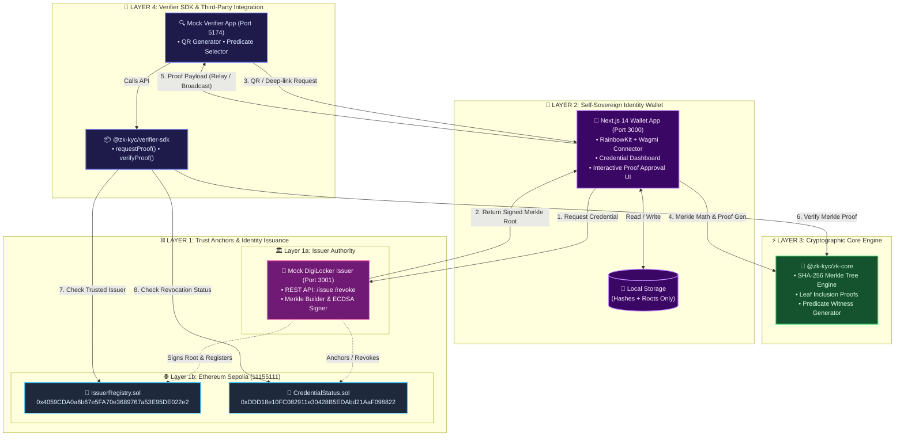
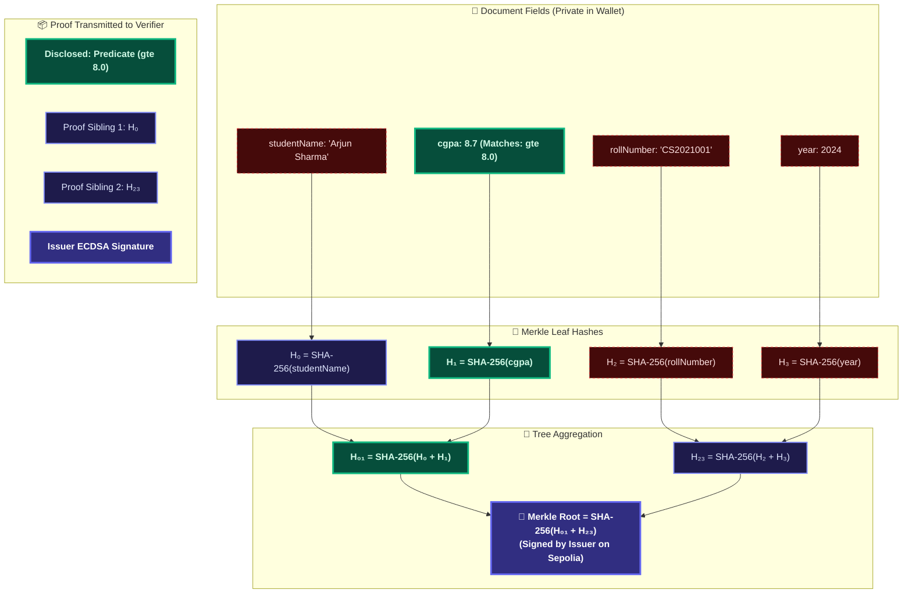
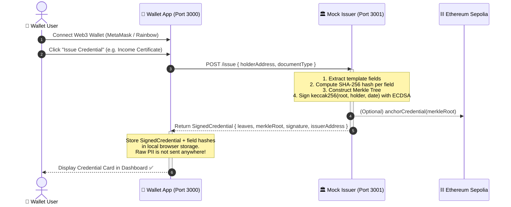
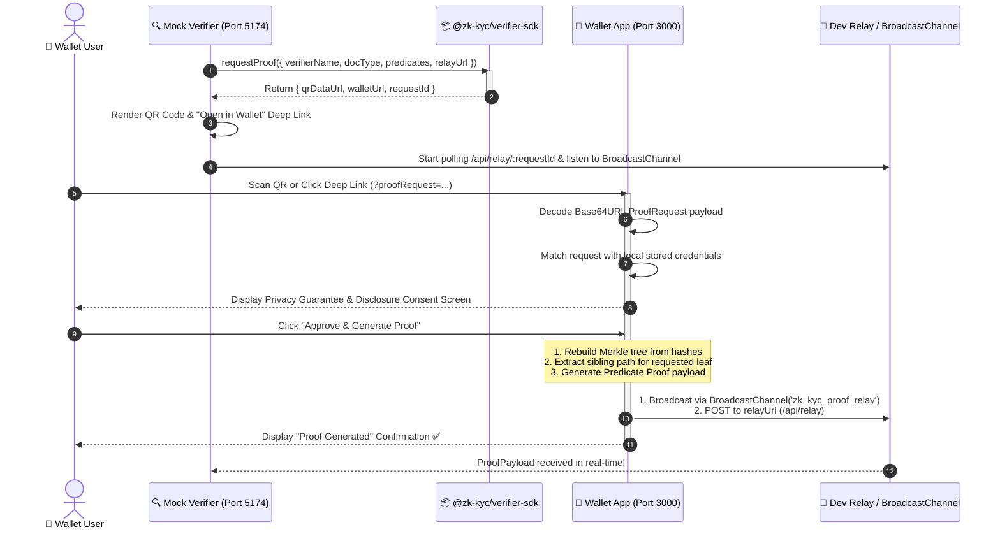
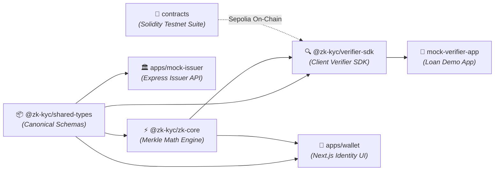
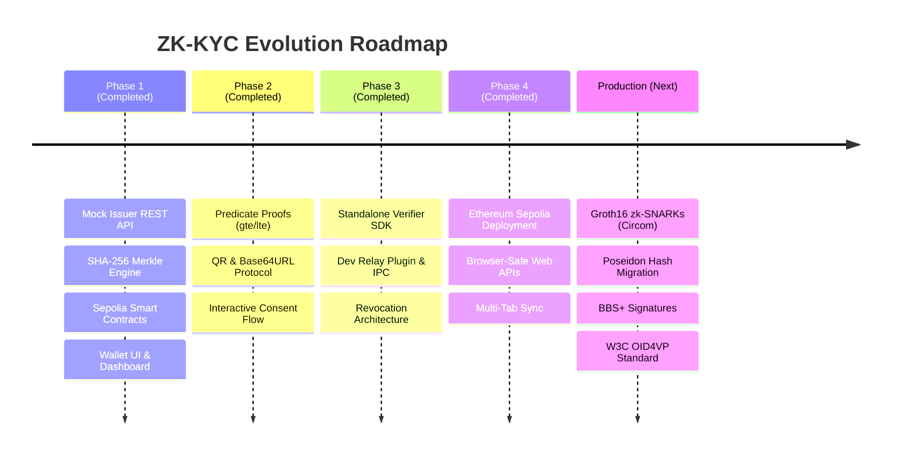

# ZK-KYC — Zero-Knowledge Identity Wallet & Verifier SDK

<div align="center">

**A privacy-preserving digital credential wallet with selective-disclosure proofs**  
*Prove what you know without revealing what you hold.*

[-6366f1?style=for-the-badge&logo=ethereum&logoColor=white)](https://sepolia.etherscan.io)
[](https://soliditylang.org)
[-000000?style=for-the-badge&logo=next.js&logoColor=white)](https://nextjs.org)
[](https://www.typescriptlang.org)
[](https://pnpm.io)
[](https://github.com)

</div>

---

## 🌟 Executive Overview

ZK-KYC is a **user-controlled digital credential wallet** and **client-side verification SDK** featuring a **zero-knowledge selective-disclosure layer**. It is engineered as a privacy-first extension to national identity infrastructures like **DigiLocker** and **NAD** (National Academic Depository).

### The Privacy Problem
Traditional KYC requires users to upload full PDFs or scans of government IDs. This leaks sensitive personal identifiable information (PII) such as full names, Aadhaar/ID numbers, home addresses, dates of birth, and exact financial figures to third parties that only need to confirm a single eligibility rule.

### The ZK-KYC Solution
With ZK-KYC:
1. **Self-Sovereign Storage**: Only cryptographic leaf hashes and the signed Merkle root are stored on the user's device. No raw documents are ever uploaded to a central server.
2. **Selective Disclosure & Predicate Proofs**: Users can cryptographically prove specific conditions (*"annualIncome ≥ 8 LPA"* or *"CGPA ≥ 8.0"*) without revealing exact numbers or any other credential fields.
3. **Standalone Verifier SDK**: Any third-party application can integrate verification with 3 lines of code. Verification runs client-side with zero backend dependencies, anchored by live smart contracts on **Ethereum Sepolia**.

> 💡 **Core Architecture Principle**: Strict separation of concerns — **Wallet ≠ Verifier**. The wallet manages identity and approves disclosures; verifier applications only consume proofs via the installable SDK.

---

## 🏛️ Interactive System Architecture



---

## 🌲 Merkle Tree & Selective Disclosure Mechanics

How a 4-field credential proves a single condition without revealing any other data:



> **Privacy Guarantee**: The verifier receives only `H₀` and `H₂₃` along with `H₁`. The verifier computes `SHA-256(H₀ + H₁) = H₀₁` and `SHA-256(H₀₁ + H₂₃) = Root`. The root matches the issuer's on-chain signature, yet the verifier learns **nothing** about `studentName`, `rollNumber`, or `year`.

---

## 🔄 End-to-End Interactive Sequence Flows

### 1. Credential Issuance Flow



---

### 2. Zero-Knowledge Proof Request & Generation Flow



---

### 3. Proof Verification & Trust Anchoring Flow

```mermaid
sequenceDiagram
    autonumber
    participant Verifier as 🔍 Mock Verifier App
    participant SDK as 📦 @zk-kyc/verifier-sdk
    participant ZK as ⚡ @zk-kyc/zk-core
    participant Sepolia as ⛓️ Ethereum Sepolia RPC

    Verifier->>SDK: verifyProof(proofPayload, { issuerRegistry, credentialStatus, rpcUrl })
    activate SDK

    rect rgb(20, 30, 50)
        Note over SDK,ZK: Step 1: Cryptographic Merkle Verification
        SDK->>ZK: verifyMerkleProof(leafHash, siblingPath, expectedRoot)
        ZK-->>SDK: ✅ Merkle path is cryptographically valid
        SDK->>ZK: verifyPredicateWitness(predicate, leafHash)
        ZK-->>SDK: ✅ Predicate satisfied without revealing raw value
    end

    rect rgb(30, 20, 50)
        Note over SDK,Sepolia: Step 2: On-Chain Trust & Revocation Check
        SDK->>SDK: Recover issuer address from ECDSA signature
        SDK->>Sepolia: IssuerRegistry.isTrustedIssuer(issuerAddress)
        Sepolia-->>SDK: Return true (Issuer is registered on-chain)
        SDK->>Sepolia: CredentialStatus.isActive(credentialRoot)
        Sepolia-->>SDK: Return true (Root is not revoked/suspended)
    end

    SDK-->>Verifier: Return VerificationResult { valid: true, checks: [...] }
    deactivate SDK

    Verifier-->>Verifier: Display "✅ Proof Valid" with cryptographic audit breakdown!
```



---

## 📦 Monorepo Architecture & Package Matrix

The project is structured as a high-performance **pnpm workspace** with strict isolation between wallet logic, verification logic, and cryptographic primitives:



### 📂 Workspace Packages Breakdown

<details open>
<summary><b>👛 <code>apps/wallet</code> — Self-Sovereign Identity Web App</b></summary>

* **Port**: `3000` | **Framework**: Next.js 14 (App Router) + Wagmi + RainbowKit
* **Purpose**: User-facing credential wallet. Imports signed credentials, stores leaf hashes in `localStorage`, visualizes Merkle trees, and handles selective disclosure approval requests from QR codes.
* **Key Files**:
  * [`src/lib/proof-generation.ts`](file:///e:/Projects/ZK-Kyc/apps/wallet/src/lib/proof-generation.ts) — Browser-safe ZK proof witness generation and Base64URL encoder/decoder.
  * [`src/lib/credential-store.ts`](file:///e:/Projects/ZK-Kyc/apps/wallet/src/lib/credential-store.ts) — LocalStorage management ensuring raw document fields never leave user control.
  * [`src/app/proof-request/page.tsx`](file:///e:/Projects/ZK-Kyc/apps/wallet/src/app/proof-request/page.tsx) — Real-time disclosure consent screen with `BroadcastChannel` proof dispatch.
</details>

<details open>
<summary><b>🏛️ <code>apps/mock-issuer</code> — Simulated Government Issuer Service</b></summary>

* **Port**: `3001` | **Framework**: Express + TypeScript + Ethers.js v6
* **Purpose**: Simulates a certified DigiLocker / University issuer. Extracts structured document fields, builds SHA-256 Merkle trees, and signs Merkle roots with ECDSA private keys.
* **Endpoints**:
  * `POST /issue` — Issues signed credentials with Merkle root & leaf hashes.
  * `POST /revoke` — Revokes an existing credential root on-chain.
  * `GET /documents` — Returns available credential templates (`INCOME_CERTIFICATE`, `MARKSHEET`).
  * `GET /issuer-info` — Returns the issuer's public Ethereum address.
</details>

<details open>
<summary><b>⚡ <code>packages/zk-core</code> — Cryptographic Merkle & Predicate Engine</b></summary>

* **Type**: Framework-agnostic TypeScript Library | **Test Suite**: 53 Unit Tests (Jest)
* **Purpose**: Core math engine responsible for SHA-256 Merkle tree generation, branch extraction, sibling path verification, and threshold/equality predicate witnesses.
* **Key Exports**:
  * `MerkleTree.fromFields(fields)` — Builds balanced Merkle trees from document key-value pairs.
  * `generateFieldProof(tree, index)` — Computes sibling hashes for leaf inclusion proofs.
  * `verifyMerkleProof(leaf, proof, root)` — Verifies inclusion in $O(\log N)$ time.
  * `generatePredicateProof(field, predicate)` — Generates commitment-based predicate witnesses (`gte`, `lte`, `eq`, `range`).
</details>

<details open>
<summary><b>🔍 <code>packages/verifier-sdk</code> — Third-Party Verifier SDK & Demo</b></summary>

* **Type**: Zero-dependency Browser/Node SDK | **Example App**: Port `5174` (Vite React)
* **Purpose**: An installable npm package for third-party developers to request and verify ZK KYC proofs with 3 lines of code.
* **Key Exports**:
  * `requestProof(options)` — Generates standardized QR codes and Base64URL deep-links.
  * `verifyProof(payload, options)` — Executes full 4-step cryptographic & on-chain verification pipeline.
  * `readIssuerRegistry(address, rpc)` & `readCredentialStatus(root, rpc)` — Direct Sepolia RPC contract readers.
</details>

<details open>
<summary><b>📜 <code>contracts/</code> — Smart Contracts Suite</b></summary>

* **Network**: Ethereum Sepolia (`11155111`) | **Tooling**: Hardhat + Solidity 0.8.24 + TypeChain
* **Contracts**:
  * [`IssuerRegistry.sol`](file:///e:/Projects/ZK-Kyc/contracts/contracts/IssuerRegistry.sol) — Owner-managed whitelist of trusted KYC issuers.
  * [`CredentialStatus.sol`](file:///e:/Projects/ZK-Kyc/contracts/contracts/CredentialStatus.sol) — Maps `bytes32 credentialRoot => Status (Active / Revoked / Suspended)`.
</details>

---

## ⛓️ Live Smart Contracts on Ethereum Sepolia

The trust anchors are live and verified on **Ethereum Sepolia (Chain ID: 11155111)**:

<div align="center">

| Smart Contract | Deployed Sepolia Address | Etherscan Link | On-Chain State |
|---|---|---|---|
| **`IssuerRegistry`** | `0x4059CDA0a6b67e5FA70e3689767a53E95DE022e2` | [View on Etherscan ↗](https://sepolia.etherscan.io/address/0x4059CDA0a6b67e5FA70e3689767a53E95DE022e2) | `Mock Issuer Whitelisted ✅` |
| **`CredentialStatus`** | `0xDDD18e10FC082911e30428B5EDAbd21AaF098822` | [View on Etherscan ↗](https://sepolia.etherscan.io/address/0xDDD18e10FC082911e30428B5EDAbd21AaF098822) | `Active & Revocation Enabled ✅` |

</div>

```solidity
// Core Smart Contract Interfaces (Solidity 0.8.24)
interface IIssuerRegistry {
    function registerIssuer(address issuer) external;
    function revokeIssuer(address issuer) external;
    function isTrustedIssuer(address issuer) external view returns (bool);
}

interface ICredentialStatus {
    enum Status { Active, Revoked, Suspended }
    function anchorCredential(bytes32 credentialRoot) external;
    function updateStatus(bytes32 credentialRoot, Status newStatus) external;
    function getStatus(bytes32 credentialRoot) external view returns (Status);
    function isActive(bytes32 credentialRoot) external view returns (bool);
}
```

* **Public RPC Endpoint**: `https://ethereum-sepolia-rpc.publicnode.com` (Zero API key required)
* **Official Faucet**: [Google Cloud Web3 Sepolia Faucet](https://cloud.google.com/application/web3/faucet/ethereum/sepolia)

---

## 🚀 Quick Start & Interactive Demo Walkthrough

### 🛠️ Prerequisites
* **Node.js** v18.0.0 or higher
* **pnpm** v8.0.0 or higher (`npm install -g pnpm`)
* **MetaMask** or any Web3 wallet switched to **Ethereum Sepolia**

---

### 1️⃣ Clone & Install Dependencies
```bash
git clone https://github.com/aditya-raj9125/ZK-Kyc.git
cd ZK-Kyc
pnpm install
```

### 2️⃣ Environment Setup
```bash
cp .env.example .env
```
> ⚡ **Zero Setup Required**: The `.env` template already includes the pre-deployed Sepolia contract addresses and public RPC configuration.

### 3️⃣ Launch the Full Monorepo
Open **three terminal tabs**:

```bash
# Tab 1: Next.js Wallet App
pnpm dev:wallet     # 🌐 Running at http://localhost:3000

# Tab 2: Mock DigiLocker Issuer API
pnpm dev:issuer     # 🏛️ Running at http://localhost:3001

# Tab 3: Mock Loan Verifier App
pnpm dev:verifier   # 🔍 Running at http://localhost:5174
```

---

## 🎬 5-Step End-to-End Walkthrough

```
┌────────────────────────────────────────────────────────────────────────────────────────────────┐
│                                   STEP-BY-STEP VERIFICATION FLOW                               │
└────────────────────────────────────────────────────────────────────────────────────────────────┘
```

| Step | Application | Action | What Happens Under the Hood |
|:---:|---|---|---|
| **1** | **Wallet** (`:3000`) | Connect MetaMask on **Sepolia** | Wallet authenticates via Wagmi & RainbowKit. |
| **2** | **Wallet** (`:3000`) | Click **"Issue Credential"** → *Income Certificate* | Mock Issuer (`:3001`) hashes fields into a Merkle tree, signs the root with ECDSA, and returns the signed credential. Only hashes are stored in `localStorage`. |
| **3** | **Verifier** (`:5174`) | Select predicate `annualIncome ≥ 8 LPA` → Click **"Generate QR Code"** | SDK encodes the `ProofRequest` into a browser-safe Base64URL string and generates a QR code + deep link. |
| **4** | **Wallet** (`:3000`) | Click deep-link or scan QR → Click **"Approve & Generate Proof"** | Wallet inspects the request, reconstructs the Merkle branch for `annualIncome`, generates a zero-knowledge predicate proof, and broadcasts it over `BroadcastChannel`. |
| **5** | **Verifier** (`:5174`) | Automatic result screen | Verifier app receives proof payload in real-time, validates the Merkle math, checks on-chain contracts (`IssuerRegistry` + `CredentialStatus`), and displays **✅ Proof Valid**! |

---

## 🧪 Cryptographic & Contract Test Suite

The repository features comprehensive test suites spanning cryptographic primitives, Merkle trees, and on-chain EVM logic:

```bash
# 1. Run Cryptographic Core Tests (53 Tests)
pnpm --filter @zk-kyc/zk-core test
```
```text
 PASS  tests/predicates.test.ts
  ✓ evaluatePredicate — equality, threshold (gte, lte, gt, lt), range (12 ms)
  ✓ generateEqProof & verifyFieldProof (15 ms)
  ✓ generatePredicateProof — gte/lte commitment witnesses (18 ms)
 PASS  tests/merkle.test.ts
  ✓ hashField & hashPair — deterministic SHA-256 (6 ms)
  ✓ MerkleTree construction — 2, 4, 8, odd-leaf trees (24 ms)
  ✓ verifyMerkleProof — valid inclusion & invalid sibling rejection (19 ms)

Test Suites: 2 passed, 2 total
Tests:       53 passed, 53 total (100% Pass)
```

```bash
# 2. Run Hardhat Smart Contract Tests (34 Tests)
pnpm contracts:test
```
```text
  CredentialStatus
    ✔ stores the IssuerRegistry reference
    ✔ unanchored credentials default to Active (0)
    ✔ isActive returns true for unanchored credentials
    ✔ allows a trusted issuer to anchor a credential
    ✔ emits CredentialAnchored event
    ✔ reverts when called by non-trusted issuer
    ✔ allows the issuing issuer to revoke a credential
    ✔ emits StatusUpdated event with correct old/new status
    ✔ reverts when a different issuer tries to update status

  IssuerRegistry
    ✔ sets the deployer as owner
    ✔ starts with no trusted issuers
    ✔ allows owner to register an issuer
    ✔ emits IssuerRegistered event
    ✔ reverts when non-owner tries to register
    ✔ can register multiple issuers
    ✔ allows owner to revoke an issuer

  34 passing (14s)
```

---

## 💻 3-Minute Verifier SDK Integration Guide

The `@zk-kyc/verifier-sdk` is designed for seamless integration into any web or Node.js application:

```bash
pnpm add @zk-kyc/verifier-sdk
```

### 1. Generate Proof Request & QR Code
```typescript
import { requestProof } from '@zk-kyc/verifier-sdk';

// Trigger a proof request with customizable predicate conditions
const { qrDataUrl, walletUrl, requestId } = await requestProof({
  verifierName: 'DeFi Lending Protocol',
  verifierAddress: '0x1234...abcd',
  issuerAddress: '0x70997970C51812dc3A010C7d01b50e0d17dc79C8',
  documentType: 'INCOME_CERTIFICATE',
  predicates: [
    { field: 'annualIncome', operator: 'gte', value: 800000 }
  ],
  relayUrl: 'https://your-app.com/api/relay',
});

// Display QR code image: 
// Or provide deep link: <a href={walletUrl}>Open in ZK-KYC Wallet</a>
```

### 2. Verify Incoming Proof Payload
```typescript
import { verifyProof, type ProofPayload } from '@zk-kyc/verifier-sdk';

async function handleProofVerification(proof: ProofPayload) {
  const result = await verifyProof(proof, {
    issuerRegistryAddress: '0x4059CDA0a6b67e5FA70e3689767a53E95DE022e2',
    credentialStatusAddress: '0xDDD18e10FC082911e30428B5EDAbd21AaF098822',
    rpcUrl: 'https://ethereum-sepolia-rpc.publicnode.com',
  });

  if (result.valid) {
    console.log('✅ KYC Verification Successful!');
    console.log('Verified Fields:', result.disclosedFields);
    console.log('Issuer Address:', result.issuerAddress);
    console.log('Audit Checks:', result.checks);
  } else {
    console.error('❌ Verification Failed:', result.error);
  }
}
```

---

## 🛡️ Security & Privacy Threat Model

| Threat / Attack Vector | Mitigation Strategy in ZK-KYC | Security Guarantee |
|---|---|---|
| **Eavesdropping on Relay** | The proof payload only contains leaf hashes, sibling hashes, and mathematical commitments. | **No PII Exposure**: An observer intercepting the relay payload cannot determine name, income, or ID. |
| **Credential Forgery** | The Merkle root is signed with the issuer's ECDSA private key. | **Unforgeable**: Forging a field requires generating a hash collision or breaking secp256k1 ECDSA. |
| **Revoked Credential Replay** | Verification checks `CredentialStatus.isActive(root)` directly on Sepolia RPC. | **Instant Invalidation**: Revoked credentials fail verification immediately on-chain. |
| **Untrusted Issuer Impersonation** | Verification resolves `IssuerRegistry.isTrustedIssuer(signer)`. | **On-Chain Governance**: Signatures from rogue or unregistered issuers are rejected. |
| **Wallet Data Theft** | Raw values are kept strictly in client-side storage and never sent over the wire. | **Self-Sovereign**: The server and verifier never receive or store the underlying document. |

---

## 📊 Technical Comparison & Production Roadmap



| Dimension | Hackathon Implementation (Testnet) | Production Architecture (Target) |
|---|---|---|
| **Proof System** | SHA-256 Merkle Inclusion + Commitment Witnesses | Groth16 / Plonk zk-SNARK Circuits (`circom` + `snarkjs`) |
| **Hash Function** | SHA-256 (Native Web API standard) | Poseidon Hash (Ultra low constraint count in SNARKs) |
| **Signatures** | ECDSA (`secp256k1`) | BBS+ Multi-Message Signatures (ZK Selective Disclosure) |
| **Data Anchoring** | Ethereum Sepolia Testnet | Ethereum Mainnet / Arbitrum / Polygon zkEVM |
| **Transport Channel** | Base64URL Query + `BroadcastChannel` + HTTP Relay | W3C OpenID for Verifiable Presentations (OID4VP) |
| **User Key Custody** | Browser `localStorage` (Isolated) | Hardware Secure Enclave / Mobile Keystore |

---

## 📚 Technical Documentation Directory

<div align="center">

| Document | Target Audience | Primary Focus |
|---|---|---|
| 📖 **[System Architecture](docs/architecture.md)** | Core Engineers & Auditors | Deep-dive cryptographic specifications, data schemas, and Circom upgrade specs |
| 🛠️ **[SDK Integration Guide](docs/sdk-integration-guide.md)** | Third-Party Developers | Comprehensive API documentation and integration snippets for `@zk-kyc/verifier-sdk` |
| 🔍 **[Assumptions & Reality Matrix](docs/assumptions.md)** | Judges & Reviewers | Transparent inventory of testnet simulations versus production requirements |
| 📜 **[Smart Contract Manual](contracts/README.md)** | Solidity Developers | Contract ABIs, deployment instructions, and test suite execution guides |

</div>

---

<div align="center">

**ZK-KYC Monorepo** · Built for Ethereum Sepolia · *Privacy-Preserving Self-Sovereign Identity*

</div>
